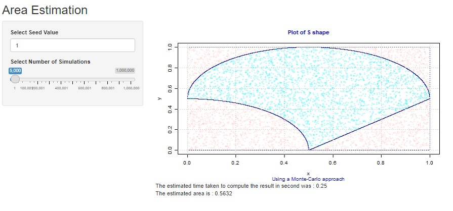

### Welcome to the library `pckghw4g5` which contains the 3 following functions: 

1. **estimate_area()** which will estimate the area and return it's value and the points information
2. **plot_area()** which plot the results using the points from estimated_area() 
3. **runDemo()** which don't need any input and will run a shiny app directly for you to play around with the functions

This website is done for the HW4.

```{r setup}
library(pkghw4g5)
```

#### estimate_area()

As stated earlier, this function returns the area and the points to be able to then plot it, here we only use 10 points for readability : 

```{r, warning = FALSE}
estimate_area(10)
```


#### plot_area()

We can then plot the results of `estimate_area()` through `plot_area()` as follows : 

```{r, warning = FALSE}
x <- estimate_area(B= 5000, seed = 10)
plot_area(x)
```

#### runDemo() 

This function is used to open the shiny app that will let you play around with numbers, you can simply use the following code to have the shiny app : 

```{r, warning = FALSE, eval = FALSE}
runDemo()
```

This will then open the following shiny app : 

{width=100%}
Where you then can change the seed so the generation of the points will be different, and use the slider to select the amount of points you would want to have the function running on. 
